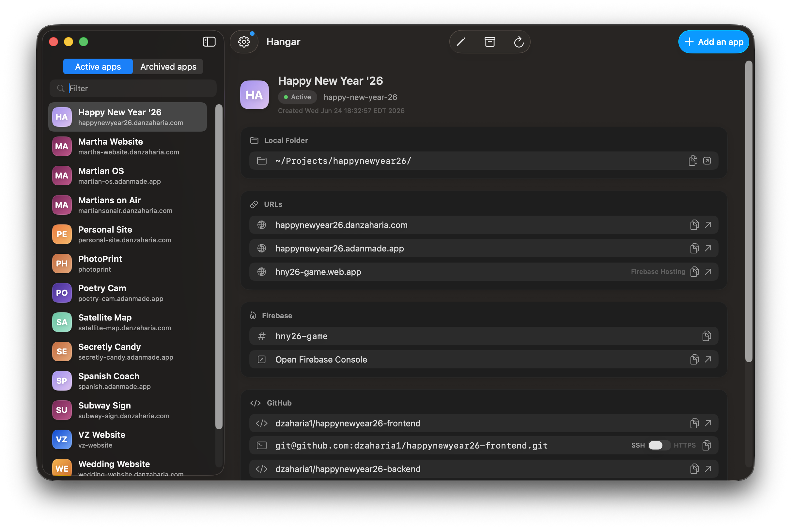

# Hangar 

Hangar is a premium SwiftUI-native macOS desktop application designed to orchestrate, monitor, and manage your Firebase deployments. It provides a visual, elegant, and interactive dashboard directly on top of the CLI-based `server-setup-scripts`.

With Hangar, the underlying shell tools continue working exactly as before, while you gain a beautiful "control tower" interface for driving setup, viewing logs, managing domains, and tracking live deployment runs.



---

## Capabilities & Features

*   **🗂️ Unified App Registry**: View your entire suite of active and archived applications loaded dynamically from `apps-registry.json`. Displays domains, localized project routes, Firebase console links, and status.
*   **🏗️ Direct Provisioning**: Scaffold new apps or archive/restore old ones. Type in the app name, and let Hangar auto-populate default domains and Firebase project IDs as you type.
*   **🪵 Live Terminal Stream**: Watch scripts execute in real-time. When provisioning an app, a terminal console streams the `setup-new-app.sh` stdout/stderr live, turning into a detail page upon success.
*   **📥 Manual App Registry Logging**: Easily import and register legacy applications without provisioning them from scratch.
*   **🐙 GitHub Actions Integration**: Fetch and display the recent execution status of GitHub Action runs for your repos using `gh run list`.
*   **⚙️ Live Configuration Manager**: Edit your setup scripts settings (billing ID, Cloudflare tokens, zones, directories) inside the app, automatically syncing to the `.settings` file.

---

## Prerequisites
- A Firebase account with a cloud billing account associated with it
- Your domain is managed on Cloudflare
- You have the GitHub CLI installed and authenticated
- You have the Firebase CLI installed and authenticated


## Installation & Setup

Before installing Hangar, clone the prerequisite server setup scripts repository to your local machine:
```bash
git clone https://github.com/dzaharia1/server-setup-scripts.git ~/Projects/server-setup-scripts
```

Next, select one of the two installation paths below to get Hangar up and running:

### Path A: Downloading the Precompiled Release (Recommended)
This is the fastest method. Precompiled releases are built locally using Xcode 26 to include full Tahoe SDK features (such as the Liquid Glass theme).

1. Download the latest `Hangar.zip` from [GitHub Releases](https://github.com/dzaharia1/Hangar/releases).
2. Unzip the file and move `Hangar.app` into your `/Applications` folder.
3. Because the release is built automatically without personal code-signing/notarization certificates, macOS Gatekeeper will block it with a warning (*"Apple could not verify..."*).
4. To bypass this, open your terminal and remove the quarantine attribute:
   ```bash
   xattr -d com.apple.quarantine /Applications/Hangar.app
   ```
5. Launch the app normally.

### Path B: Building from Source (Local Compilation)
If you prefer to compile Hangar from source:

1. Ensure you have **Xcode 16+** installed on **macOS 15 (Sequoia)** or newer.
2. Open the Xcode project:
   ```bash
   open Hangar/Hangar.xcodeproj
   ```
3. In Xcode, ensure the **Hangar** target is selected, and press **⌘R** (or click the Play button) to build and run the app.
4. Copy the compiled `Hangar.app` binary to `/Applications` if desired.

---

### Linking Hangar to the Setup Scripts
On your first launch, Hangar will check common locations (like `~/Projects/server-setup-scripts`) for the scripts. If it cannot auto-detect them, you will see an empty setup state:

1. Click **Locate Setup Scripts…** (or open Settings with **⌘,** / select **Hangar > Settings…**).
2. Under **App settings**, look for **Setup scripts folder**.
3. Click **Change…** and select the folder where you cloned `server-setup-scripts` (e.g., `/Users/yourusername/Projects/server-setup-scripts`). *Note: This folder must contain the `setup-new-app.sh` script.*
4. Under **Hangar settings**, configure your setup variables:
   *   **Local Projects Directory**: The directory where new projects are scaffolded (e.g., `~/Projects`).
   *   **Billing Account ID**: Your Google Cloud/Firebase billing account ID.
   *   **Cloudflare API Token & Zones**: For automated domain provisioning.
5. Click **Save**. Hangar will write these configurations directly to the `.settings` shell config file within your scripts repository.

---

## System Architecture

Hangar is built as a non-sandboxed native orchestrator to allow seamless integration with your local files and system commands:
*   **File Syncing**: Directly parses and writes to `<scripts-folder>/apps-registry/apps-registry.json`.
*   **Shell Orchestration**: Spawns sub-processes using a login `zsh` session (`ScriptRunner`), ensuring that your local tools like `gh`, `firebase`, `gcloud`, `npm`, `jq`, and `git` are loaded with your system environment.
*   **Settings Management**: Edits compile into the standard bash syntax for `.settings` so that your manual terminal scripts and Hangar use the exact same configuration state.

---

## Troubleshooting & Tips
> [!NOTE]
> Since Hangar executes commands and reads your workspace directory, the App Sandbox is disabled. This is intended for local developer workflows.

*   **Refresh Registry**: Hangar loads the registry on startup. Press **⌘R** (or click the reload button) to force a refresh if you've run scripts or modified files manually in your terminal.
*   **CLI Requirements**: Make sure you have `gh` (GitHub CLI), `firebase-tools`, `gcloud`, and `npm` installed and authenticated in your terminal environment.
